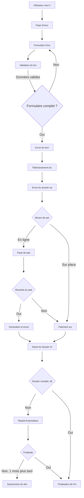
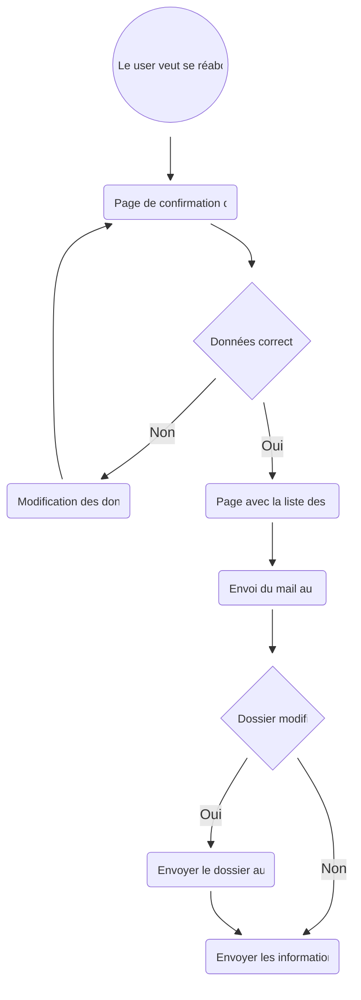
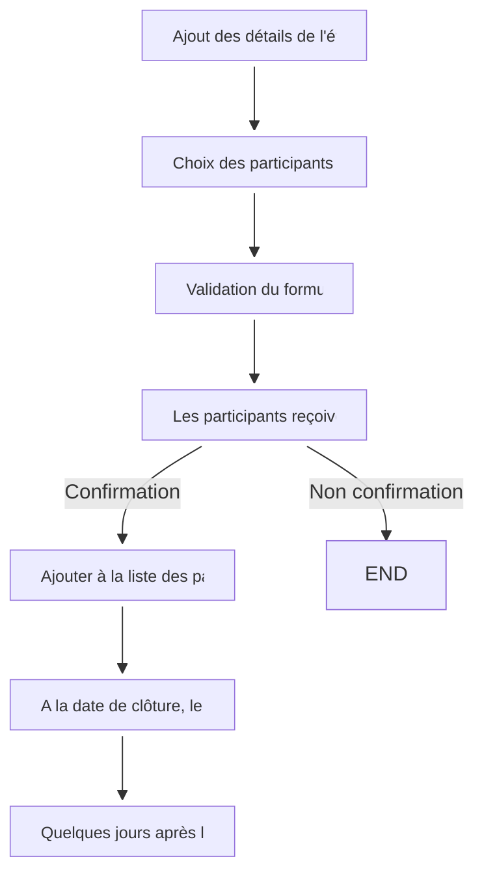
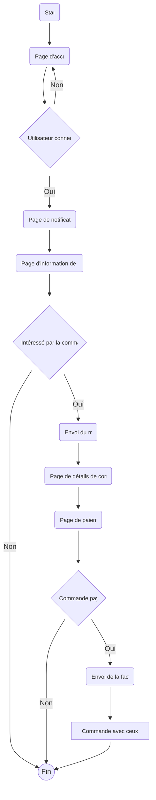
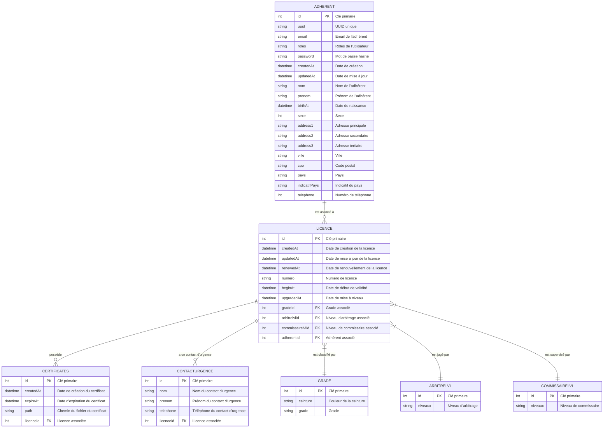

# Dossier de réalisation d'un site internet pour le Tsunami Club de Judo

## Introduction

Le présent dossier a pour objectif de présenter le projet de réalisation d'un site internet pour le Tsunami Club de Judo. Ce site web sera un outil essentiel pour répondre aux besoins et attentes de notre audience cible, composée des adhérents de l'association, des parents des adhérents, des futurs adhérents, des gérants de l'association, des entraîneurs, ainsi que des partenaires et sponsors du club.

## Table des matières

- [Dossier de réalisation d'un site internet pour le Tsunami Club de Judo](#dossier-de-réalisation-dun-site-internet-pour-le-tsunami-club-de-judo)
  - [Introduction](#introduction)
  - [Table des matières](#table-des-matières)
  - [Présentation du Tsunami Club de Judo](#présentation-du-tsunami-club-de-judo)
  - [Problématique et besoins](#problématique-et-besoins)
  - [Valeur ajoutée et avantages concurrentiels](#valeur-ajoutée-et-avantages-concurrentiels)
  - [Objectifs spécifiques du site internet](#objectifs-spécifiques-du-site-internet)
  - [Description du site internet](#description-du-site-internet)
  - [Structure du site internet](#structure-du-site-internet)
    - [L'espace public](#lespace-public)
      - [Landing page](#landing-page)
      - [Accueil](#accueil)
      - [Page présentation des disciplines et de l'équipe dirigeante](#page-présentation-des-disciplines-et-de-léquipe-dirigeante)
      - [Événements et calendrier](#événements-et-calendrier)
      - [Informations et Contact](#informations-et-contact)
      - [Blog](#blog)
      - [Connexion](#connexion)
      - [Inscription](#inscription)
    - [Espace membre](#espace-membre)
      - [Page d'espace membre](#page-despace-membre)
      - [Page profil](#page-profil)
      - [Page blog (gestion)](#page-blog-gestion)
      - [Page de messagerie](#page-de-messagerie)
    - [L'espace administrateur](#lespace-administrateur)
      - [Page d'espace administrateur (#page-espace-administrateur) :](#page-despace-administrateur-page-espace-administrateur-)
        - [Page liste des membres](#page-liste-des-membres)
        - [Page detail d'un membre](#page-detail-dun-membre)
        - [Page d'ajoute d'un membre](#page-dajoute-dun-membre)
        - [Page liste des articles](#page-liste-des-articles)
        - [Page detail d'un article](#page-detail-dun-article)
        - [Page d'ajoute d'un article](#page-dajoute-dun-article)
        - [Page de Validation des articles](#page-de-validation-des-articles)
      - [Pages gestion des evenements](#pages-gestion-des-evenements)
      - [Pages gestion des sponsors et partenaires](#pages-gestion-des-sponsors-et-partenaires)
      - [Page gestion des paiements](#page-gestion-des-paiements)
  - [Workflow](#workflow)
    - [Inscription et paiement des frais d'inscription](#inscription-et-paiement-des-frais-dinscription)
    - [Renouvellement de licence](#renouvellement-de-licence)
    - [Ajout d'évenement](#ajout-dévenement)
    - [Commandes et paiement](#commandes-et-paiement)
  - [Conclusion](#conclusion)
  - [bdd](#bdd)
<!-- - [Budget estimé](#budget-estimé) -->
<!-- - [Calendrier prévisionnel de développement](#calendrier-prévisionnel-de-développement) -->

## Présentation du Tsunami Club de Judo

Le Tsunami Club de Judo est une association sportive dynamique située en Guadeloupe. Notre club offre des cours de judo pour tous les âges et tous les niveaux, et participe activement à des compétitions régionales et nationales. Notre objectif est de promouvoir les valeurs du judo, telles que le respect, la discipline et le dépassement de soi, tout en favorisant la convivialité et la cohésion entre nos adhérents.

## Problématique et besoins

Le Tsunami Club de Judo fait face à plusieurs problématiques et besoins que nous souhaitons résoudre grâce à la réalisation de notre site internet. Parmi ces besoins, nous pouvons citer :

- Gestion administrative : Simplifier les processus d'inscription en ligne et de paiement des frais d'adhésion et autres services, afin de fluidifier la gestion administrative du club.
- Communication : Améliorer la communication entre les adhérents et l'association en fournissant un accès facile aux horaires des entraînements, aux dates des événements tels que les compétitions et les stages, ainsi qu'aux informations importantes.
- Archivage des événements : Offrir la possibilité de conserver une trace des compétitions, des stages et autres événements organisés par le club, à travers la mise en ligne de photos, de vidéos et d'autres médias.
- Gestion des adhérents : Mettre en place un système de gestion des adhérents efficace, permettant de faciliter le suivi, les communications personnalisées et les rappels d'échéances.
- Mise en avant des partenaires et sponsors : Valoriser nos partenaires et sponsors en leur offrant une visibilité accrue à travers notre site internet, ce qui renforcera nos liens avec eux.
- Promotion des compétiteurs : Mettre en avant nos compétiteurs et leurs résultats afin de renforcer leur visibilité et de susciter l'intérêt de potentiels partenaires et sponsors.
- Actions de l'association : Promouvoir les actions menées par l'association, telles que les formations, les événements caritatifs, etc., pour favoriser leur réussite et leur participation active.

## Valeur ajoutée et avantages concurrentiels

Le site internet du Tsunami Club de Judo présente plusieurs avantages concurrentiels par rapport aux autres acteurs du marché :

- Absence de concurrence locale : Nous avons constaté qu'il existe peu, voire aucun site similaire dédié au judo dans notre région, ce qui nous positionne en tant que précurseurs dans ce domaine.
- Fluidité de la communication : Notre site internet permettra une communication directe et fluide entre les adhérents et l'association, facilitant ainsi les échanges d'informations et renforçant les liens au sein du club.
- Simplification des processus administratifs : Grâce à notre plateforme en ligne, nous souhaitons simplifier les démarches administratives telles que l'inscription et le paiement, offrant ainsi un gain de temps pour les gérants de l'association et une meilleure expérience pour nos adhérents.
- Vitrine de communication : Le site internet sera une véritable vitrine de communication pour nos compétiteurs, leur permettant de se mettre en valeur auprès de nos partenaires et sponsors, favorisant ainsi de potentielles collaborations et soutiens financiers.

## Objectifs spécifiques du site internet

Nous avons identifié les objectifs spécifiques suivants pour notre site internet :

- Fluidifier les processus administratifs en automatisant les inscriptions et les paiements en ligne.
- Réduire la charge de travail administrative pour les gérants de l'association.
- Améliorer la communication entre les adhérents et l'association, en mettant à disposition les horaires des entraînements, les dates des événements, les informations importantes, etc.
- Attirer de nouveaux adhérents pour le Tsunami Club de Judo grâce à une meilleure visibilité en ligne.
- Accroître la visibilité de nos partenaires et sponsors, renforçant ainsi notre relation avec eux.
- Augmenter la renommée du club et son rayonnement dans la région.
- Favoriser une meilleure cohésion entre les adhérents du club grâce à une plateforme commune de communication et d'échanges.

## Description du site internet

Le site internet du Tsunami Club de Judo sera développé en utilisant le framework Symfony 6.2 avec PHP 8.1. Voici les principales caractéristiques du site :

- Design : Le design du site sera moderne, responsive, avec un style épuré en noir et blanc, agrémenté de touches de couleurs.
- Fonctionnalités : Le site proposera les fonctionnalités suivantes :
  - Gestion des adhérents : Inscriptions en ligne, gestion des informations personnelles, suivi des paiements, etc.
  - Gestion des événements : Affichage des horaires des entraînements, des dates des compétitions, stages et autres événements, possibilité de s'inscrire aux événements, etc.
  - Gestion des partenaires et sponsors : Mise en avant des logos et informations des partenaires et sponsors, pages dédiées, etc.
  - Galerie média : Mise à disposition de photos et vidéos des compétitions et autres événements.
  - Blog : Publication d'articles et de news concernant le club, les résultats des compétitions, etc.
  - Espace membre : Accès réservé aux adhérents pour consulter des ressources spécifiques et communiquer entre eux.
- Technologies utilisées : Symfony, PHP, HTML5, CSS3, JavaScript, MySQL.

## Structure du site internet

Le site internet du Tsunami Club de Judo sera divisé en plusieurs espaces, chacun ayant une fonctionnalité spécifique. Voici les principaux espaces du site :

### L'espace public

L'espace public du site internet sera accessible à tous les visiteurs. Il servira de vitrine au club et permettra de mettre en avant les informations importantes, les événements, les partenaires et sponsors, etc. Voici les principales pages de l'espace public :

#### Landing page

Page tampon avant l'accueil permettant une connexion rapide aux espaces membres et administrateurs. Cette page devra être sobre et simple. Elle posera les bases du design et de l'ambiance du site internet.

#### Accueil

Page d'accueil du site internet sous la forme d'un hub central permettant d'accéder aux différentes sections du site internet. Elle sera organisée comme un tableau 1x2x2x2x1 ou 1x2x2x1x1 avec les sections suivantes :

<table>
	<tr>
		<td colspan="2" align="center">Section 1</td>
	</tr>
	<tr>
		<td>Section 2</td>
		<td>Section 3</td>
	</tr>
	<tr>
		<td>Section 4</td>
		<td>Section 5</td>
	</tr>
	<tr>
		<td>Section 6</td>
		<td>Section 7</td>
	</tr>
	<tr>
		<td colspan="2" align="center">Section 8</td>
	</tr>
</table> 

ou

<table>
	<tr>
		<td colspan="2" align="center">Section 1</td>
	</tr>
	<tr>
		<td>Section 2</td>
		<td>Section 3</td>
	</tr>
	<tr>
		<td>Section 4</td>
		<td>Section 5</td>
	</tr>
	<tr>
		<td colspan="2" align="center">Section 6</td>
	</tr>
	<tr>
		<td colspan="2" align="center">Section 8</td>
	</tr>
</table> 

- **Section 1 :** 
  - Déroulant : Présentation du club et de ses valeurs, avec accès à la présentation de l'équipe dirigeante et à la page de contact, ainsi qu'un appel à l'action pour l'inscription.

- **Section 2 :** 
  - Accès aux horaires des entraînements, avec lien vers la page de contact.

- **Section 3 :** 
  - Accès à une présentation des disciplines enseignées, avec lien vers la page de présentation des disciplines et de l'équipe dirigeante.

- **Section 4 :** 
  - Accès à la page de contact.

- **Section 5 :** 
  - Accès à la page du calendrier.

- **Section 6 :** 
  - Accès à la partie blog du site, incluant photos, vidéos et résultats de compétitions.

- **Section 7 :** 
  - Accès à la page des partenaires et sponsors, avec lien vers la partie "partenaires" de la page du blog. Cette section ne s'affiche que si des partenaires sont enregistrés dans la base de données.

- **Section 8 :** 
  - Appel à l'action incitant les visiteurs à s'inscrire au club, avec lien vers la page d'inscription. Si l'utilisateur est déjà connecté, il est redirigé vers l'espace utilisateur.

#### Page présentation des disciplines et de l'équipe dirigeante

Page divisée en deux parties :

- Présentation des disciplines enseignées.
- Présentation de l'équipe dirigeante.

Les utilisateurs arrivant sur cette page verront directement la partie qui les intéresse grâce à un système d'ancrage et de scroll automatique. Un accès au formulaire de contact sera disponible à chaque section.

#### Événements et calendrier

Page permettant de consulter les événements à venir. Les événements seront affichés sous forme de liste avec un système de filtre par type d'événement. Ils seront également affichés sur un calendrier.
La liste et le calendrier seront affichés simultanément. Sur la version mobile, une liste des événements par mois sera affichée.
Les événements seront cliquables et mèneront vers une page détaillée de l'événement.
Les événements internes (formations, stages du club) ne seront visibles que par les membres connectés et concernés. Les événements externes (compétitions, stages de ligue, opérations extérieures) seront visibles par tous.

#### Informations et Contact

Page permettant de consulter les informations de contact du club (adresse, téléphone, e-mail, etc.) ainsi qu'un formulaire de contact.
La page sera divisée en deux parties :
- Partie 1 : Informations de contact, adresses, horaires, etc.
- Partie 2 : Formulaire de contact.

#### Blog

Page représentant un espace d'actualité à part entière. Elle servira à mettre en avant les résultats des compétitions, les photos et vidéos des événements, les articles de presse, etc.
Elle servira également à mettre en avant les partenaires et sponsors du club et nos sportifs à travers, par exemple, des courtes capsules ou des photos.
Le blog sera divisé en 3 parties :
- **Partie 1 : Retour d'événements (compétitions, stages, etc.)** :
  - Les retours d'événements seront affichés sous forme de liste avec un système de filtre par type d'événement. En cliquant sur un événement, l'utilisateur sera redirigé vers une page détaillée de l'événement, affichant la date, le lieu, les résultats, les photos, les vidéos, etc. Un système de recherche sera également mis en place pour permettre à l'utilisateur de trouver rapidement l'événement qu'il recherche.
- **Partie 2 : Notre club et son actualité** :
  - La partie actualité se présentera sous la forme d'un fil d'actualité avec un système de recherche. Les actualités seront cliquables et mèneront vers une page détaillée de l'actualité.
- **Partie 3 : Nos partenaires et sponsors** (à prévoir mais non prioritaire) :
  - La partie partenaires et sponsors mènera vers la liste des partenaires et sponsors du club. Les partenaires et sponsors seront cliquables et mèneront vers une page détaillée du partenaire ou sponsor, présentant l'entreprise et ses activités.
  
La page principale sera divisée en 3 parties, présentant les événements les plus récents de chaque partie.

#### Connexion

La page de connexion permettra aux utilisateurs de se connecter à leur espace personnel. Elle sera accessible depuis le menu de navigation. Elle sera également accessible depuis la page d'inscription pour les utilisateurs ayant déjà un compte.
La page donnera également accès à la page d'inscription pour les utilisateurs n'ayant pas encore de compte, ainsi qu'à la page de réinitialisation du mot de passe pour les utilisateurs ayant oublié leur mot de passe.

#### Inscription

La page d'inscription donnera accès au formulaire d'inscription. Elle sera accessible depuis le menu de navigation et depuis la page de connexion pour les utilisateurs n'ayant pas encore de compte. Afin d'optimiser l'expérience utilisateur, le formulaire complet sera divisé en étapes. L'utilisateur devra remplir les champs obligatoires pour passer à l'étape suivante et pourra revenir en arrière afin de modifier les informations saisies. Une fois le formulaire complet, l'utilisateur accédera à une page de confirmation de son inscription, l'informant que son inscription a bien été prise en compte, que certaines pièces sont à fournir et qu'il recevra un e-mail de confirmation avec sa fiche d'inscription et un récapitulatif des pièces à fournir et du/des paiements à effectuer.

### Espace membre

L'espace membre sera accessible depuis le menu de navigation. Il sera accessible uniquement aux utilisateurs connectés. 
Les membres auront accès à différentes pages supplémentaires du site :

#### Page d'espace membre

La page d'espace membre sera la page d'accueil de l'espace membre. Elle permettra aux utilisateurs d'accéder à leurs différents espaces dédiés (profil, blog, messagerie, etc.). 
Elle permettra également de voir certaines actualités ou événements réservés aux membres.

#### Page profil

La page profil permettra aux utilisateurs de consulter et de modifier leurs informations personnelles. Ils pourront également consulter leurs informations de paiement et de licence.
Ils pourront également récupérer leurs documents d'inscription et de paiement, et avoir accès à leurs paiements en ligne ou à leur historique de paiement.
Elle sera accessible depuis le menu de navigation.

#### Page blog (gestion)

Les utilisateurs pourront ajouter des articles au blog ou modifier un article existant. Un système de validation sera mis en place afin de valider les articles avant leur publication. 
Ils n'auront pas accès à la gestion des sponsors et partenaires.

#### Page de messagerie

Les utilisateurs pourront consulter leurs messages reçus (demande de confirmation, de participation à un événement, etc.) auxquels ils pourront répondre. 
Un système de notification sera mis en place afin de notifier les utilisateurs de la réception d'un nouveau message.

###	L'espace administrateur

L'espace administrateur est une variante de l'epace membre. Il permettra aux administrateur du site d'acceder a des pages supplementaires de gestion du site.

#### Page d'espace administrateur (#page-espace-administrateur) :

La page d'espace administrateur sera la page d'accueil de l'espace administrateur. Elle permettra aux administrateur d'acceder a leurs differents espace dedier.

##### Page liste des membres

La page liste des membres permettra aux administrateur de consulter la liste des membres du club. 

##### Page detail d'un membre

Sur cette page, les in pourront consulter les informations personnelles des membres, leurs informations de paiement et de licence, leurs documents d'inscription et de paiement, leurs paiement en ligne ou historique de paiement etc.

##### Page d'ajoute d'un membre

La page d'ajout de membre permettra aux administrateur d'ajouter un membre au club. Un systeme de validation sera mis en place afin de valider les informations avant l'ajout du membre.

##### Page liste des articles 

La page liste des articles permettra aux administrateur de consulter la liste des articles du blog par categorie.

##### Page detail d'un article 

Sur cette page, les administrateur pourront consulter les informations d'un article, le modifier ou le supprimer.

##### Page d'ajoute d'un article 

La page d'ajout d'article permettra aux administrateur d'ajouter un article au blog. 

##### Page de Validation des articles 

La page de validation des articles permettra aux administrateurs de valider les articles avant leur publication. Les articles pourront etre modifier si besoin avant validation.

#### Pages gestion des evenements 

La page liste des evenements permettra aux administrateur de consulter la liste des evenements du club. Elle permettra d'avoir une vu sur tout les evenements a venir et passé. et de pouvoir en ajouter ou en modifier si besoin.

#### Pages gestion des sponsors et partenaires 

La page l permettra aux administrateur de consulter la liste des sponsors et partenaires du club. Elle permettra d'avoir une vu sur tout les sponsors et partenaires du club et de pouvoir en ajouter si besoin. 

#### Page gestion des paiements 

La page de gestion des paiement permettra de centraliser et suivre les paiement en attentes et en retard.
Dans cette espace il sera possible par exemple de modifier le mail de relance en cas de paiement en retard ou encore de creer un nouveau produit en cas par exemple de commande grouper

## Workflow

### Inscription et paiement des frais d'inscription

### Renouvellement de licence

### Ajout d'évenement

### Commandes et paiement

<!-- ## Budget estimé

Le budget estimé pour la réalisation du site internet du Tsunami Club de Judo est de 12 000€. Celui-ci comprend les coûts de développement, de design, d'hébergement et de maintenance.

### Frais annexes

Des frais annexes sont à prévoir, tels que :
- Nom de domaine : 20€/an
- Hébergement : Prix variable allant de 5€/an à 20€/an.

## Calendrier prévisionnel de développement

-	Juillet : Realisation des maquettes et prototype
-	Aout : Developpement de la V1
	-	V1 : Systeme de paiement et d'inscription.
		Possibilité de realiser des commande, et envoie de message
		Gestion efficace des utilisateur
-	Septembre : Developpement V2 et resolution de bug
	-	Mise en place du blog, de la galerie et du systeme d'evenement
-	Decembre : Integration de reste des fonctionnalités -->

## Conclusion

La création d'un site internet pour le Tsunami Club de Judo est une étape essentielle pour répondre aux besoins de communication, de gestion et de promotion de notre association. Ce site web nous permettra de renforcer notre présence en ligne, d'attirer de nouveaux adhérents, de mieux communiquer avec nos membres, de valoriser nos partenaires et sponsors, et de consolider notre positionnement sur le marché du judo dans notre région. Avec un design moderne et des fonctionnalités adaptées, nous sommes convaincus que notre site internet sera un outil clé pour soutenir le développement et la réussite du Tsunami Club de Judo.

## bdd

